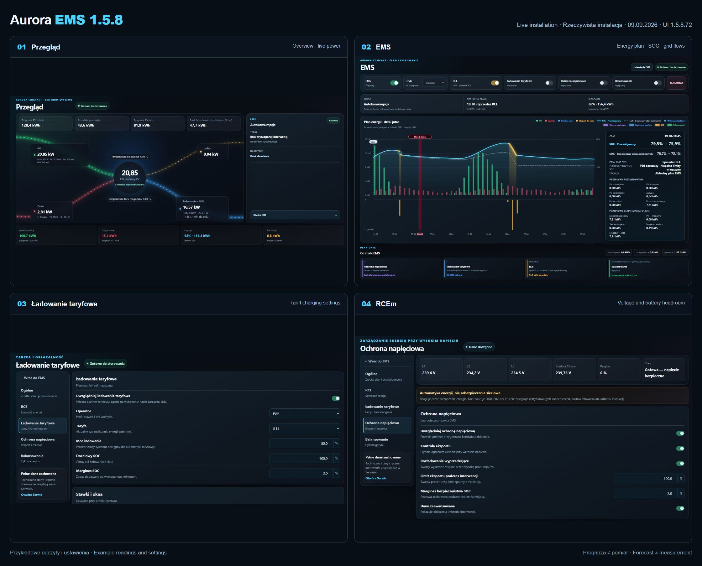

# EMS for Hoymiles — 1.5.8RC2

[English](README.md) · [Polski](README.pl.md)


Unofficial local EMS for Hoymiles energy-storage installations, built with
Home Assistant, ESPHome and Modbus. Includes dynamic sales (RCE/Pstryk),
tariff charging, PV/household forecasts and experimental RCEm.

Users of **1.5.7** report operation with **HiOne, HIT-(5–20)L-G3, HAS and HAT**.
HIT-G3 remains the reference implementation; see the
[compatibility scope](docs/COMPATIBILITY.md#english) for the distinction
between community reports and exact-model acceptance.

[](https://my.home-assistant.io/redirect/hacs_repository/?owner=Kaluzaburza&repository=hoymiles-hit-g3-ems&category=integration)
[](https://github.com/Kaluzaburza/hoymiles-hit-g3-ems/releases/latest)
[](https://github.com/Kaluzaburza/hoymiles-hit-g3-ems/actions/workflows/validate.yml)
[](LICENSE)

The project connects an ESP32 to the inverter over Modbus RTU and adds a
localized Home Assistant integration, the Aurora dashboard, and optional EMS
automations. All control logic runs locally. Forecast-based features use
Solcast. Prices come from public PSE data for RCE or public hourly Pstryk
net prices for Pstryk BUY/SELL; Pstryk does not require an account API key.

**New installation:** follow the [five-step quick start](docs/QUICK_START.md#english--five-steps).
An installation and feature overview is also included below.

## Overview

> **1.5.8RC2 — release candidate.** Frontend `1.5.8rc2.122`.
> [Release and update steps](docs/releases/v1.5.8rc2.md) · [Upgrade from 1.5.7](docs/UPGRADE_1_5_7.md).
> Enable prereleases in HACS to select RC2.



Four views from a real installation running Aurora `1.5.8.72`, captured on
9 September 2026. These historical `.72` images illustrate the layout; they
do not show the current `.122` labels or confirm RC2 execution.
Values and enabled options belong to that installation;
these are not fresh-install defaults or guaranteed future results. The UI in
the screenshots is Polish; the dashboard also includes an English version.
Open the originals: [Overview](docs/images/dashboard-start-v1.5.8.png),
[EMS plan](docs/images/dashboard-ems-v1.5.8.png),
[tariff settings](docs/images/dashboard-tariff-v1.5.8.png),
[RCEm](docs/images/dashboard-rcem-v1.5.8.png).

Aurora brings current power, battery charge, planned actions and diagnostics
into one Home Assistant dashboard. Its main tabs are **Overview, EMS,
Settings, PV, Battery, Energy and Earnings**. Settings groups dynamic sales, tariff charging,
voltage management and balancing; **Service** contains technical diagnostics
and manual controls. Desktop and mobile use the same data.

### What is new in 1.5.8RC2

- **Earnings:** day/week/month/year views use an entry-scoped local archive.
  Purchase and sale show separate kWh, amounts and tariff-zone/provider breakdowns;
  missing prices or historical counters are not invented. See [Earnings](docs/EMS_PROFITS.md).

- **Dynamic sales:** RCE and Pstryk share this label in the main dashboard,
  plans and push notifications. The selected price source remains visible;
  experimental RCEm is a separate policy.
- **Pstryk BUY/SELL:** one linked price profile uses public hourly `priceNet`
  directly for both directions, without added VAT, distribution or fees.
  Buying and selling retain separate permissions. Verified daily prices survive
  an HA restart; missing prices do not become zero-price opportunities.
- **PGE G12e:** monthly daytime cheap periods, 22:00–06:00 nights, weekends
  and Polish public holidays. The automatic 2026 price profile has a defined
  contract, territory and validity period; see [G12e details](docs/PGE_G12E.md).
- **PV charging delay:** Conservative 55% (P10), Balanced 50% and Maximum 20%
  profiles control the forecast allowance for charging later after exporting
  PV. New starts are allowed before 14:00 Europe/Warsaw time, when the plan can recover
  the energy by 16:30 and one hour before forecast surplus ends. The fixed
  180-second startup window is fixed from the first command. Confirmation
  requires fresh matching full FC03/Mode5; PV/LOAD/GRID/BAT/BMS power values
  remain diagnostic, without power or balance vetoes. Topology, device/BMS
  readiness, SOC, permissions, lease and the original deadline remain binding.
  A new neutral attempt needs a 180-second cooldown and fresh qualification;
  replanning does not extend the deadline.
- **Transaction continuity:** compatible changes of power/target preserve the
  transaction. Lease protocol 2 limits a lease to 120 seconds, normally renews
  it every 20 seconds and qualifies physical settling over 180 seconds.
  A displayed plan still requires current inputs and physical readback.
- **More useful diagnostics:** decoded execution/STOP evidence, plan and input
  revisions, LOAD/PV provenance and a bounded notification ledger support
  offline algorithm analysis. The archive explicitly reports evidence limits.
- **Faster RCE planning:** the unchanged 110-slot performance test fell from
  about 1.22 s to 0.767 s with its 1 s limit retained; all 86 RCE scenarios
  passed locally. This is a test-machine result, not a speed promise for every HA host.
- **Installation documentation:** an original wiring diagram, bilingual
  five-step instructions and model-specific compatibility guidance.

The 1.5.8 series also brings one PV/LOAD/grid/SOC timeline, interval details,
**Yesterday / Current** execution history, reasons next to planned actions,
mobile navigation, and a system-status dialog with recorded faults.
Chart refresh is separate from control and planning timers.

Fresh installations use a **5 percentage-point SOC margin** for dynamic sales
and RCEm, and a **5% demand-energy margin** for tariff charging. Initial power
settings are **50%** for dynamic discharge, tariff charging and the RCEm export
cap; the tariff minimum saving is **1 PLN/kWh**. Existing settings are preserved.
A high saving threshold can legitimately leave no profitable charging plan.

Technical deployment checks and offline tests do not complete field acceptance.
See the [release status](docs/releases/v1.5.8rc2.md#validation-and-known-limits).

The PV-profile percentage is the P10 weight in `P50 × (1 − w) + P10 × w`;
it is neither a probability nor a fixed production reduction. See
[PV delay profiles](docs/PV_DELAY_PROFILES_2026-10-02.md).

### Included functions

| Area | What it does |
|---|---|
| Local monitoring | Shows PV, household load, grid, battery/BMS, GEN, alarms, temperatures and energy totals; uses system totals on detected parallel installations |
| Dynamic sales (RCE/Pstryk) | Plans permitted export using the selected market prices, available energy, operating reserve and physical limits |
| Pstryk purchasing | Coordinates buying and selling with one hourly net-price profile and independent execution permissions |
| Tariff charging | Plans needed grid energy in cheaper periods, accounting for demand, PV, losses, battery wear and the required saving |
| Experimental RCEm | Models battery headroom for high-voltage periods; observation mode calculates without writing to the inverter |
| LiFePO4 balancing | Schedules a service charge, uses PV first, finishes from the grid when necessary and holds full SOC for the configured duration |
| Manual control | Exposes operating modes, power/SOC limits and schedules, subject to the implemented control and readback gates |
| Diagnostics | Explains data quality, execution owner, blocked actions and physical acknowledgements; exports privacy-filtered support ZIPs |

### How a plan becomes a real action

1. The ESP32 reads the inverter over Modbus. HA combines those readings with
   your settings, household history, PV forecasts and the prices each planner needs.
2. The selected planners calculate proposals; linked Pstryk buying/selling
   uses a joint plan. The EMS supervisor selects an eligible action. **A configured policy, a displayed plan and
   active execution are three different states.**
3. Before a write, the EMS checks current inputs, limits, mode and ownership.
   Only one writer controls an execution transaction. Missing or stale critical
   data prevent new execution even if an older plan is still displayed.
4. A newer physical register readback must confirm the command. After the
   action, the existing verified restore procedure releases ownership.
   An HA switch changing state is not proof that the inverter obeyed it.

For example, **Now: Self-consumption** with **Next: Dynamic sales at 19:30** means
that ordinary self-consumption is active now and sale is planned for later.
The plan may change when new prices, forecasts or physical limits arrive.
A tariff result such as *charging skipped: insufficient saving* is a valid
planning outcome; enabling the policy does not force a purchase.

### EMS controls

**Pause EMS** stops Supervisor execution and every bundled legacy automation
through a separate fail-closed latch. It preserves the selected RCE, tariff,
RCEm and balancing policies. **Enable EMS** restores Active authority only after
that latch is released. Each **Use this policy** control applies the planner's
enabled and Supervisor allow helpers as one serialized operation; an incomplete
operation leaves execution blocked. **MASTER STOP** remains the emergency
transaction: it cancels active work, restores verified settings and clears
execution helpers. **Resume after STOP** is a separate conscious action which
restores the policy choices saved before the stop. The single status badge
distinguishes paused, ready, executing, waiting for readback, blocked, recovery
and intervention states.

Hard-stop evidence is frozen when its trigger is admitted. Independent bounded FIFO admission lanes
preserve trigger order. An already running verified helper call cannot be cancelled; its safety boundary
is checked again when it returns.
Until that boundary is resolved, the durable record remains raw `APPLYING`.

### How household LOAD is forecast

The canonical household demand is the sum of phase LOAD registers 2170–2172,
integrated by `sensor.hoymiles_actual_load_energy_today`. It excludes inverter
self-consumption and does not treat grid import as household demand, so energy
supplied by PV or the battery remains in the same boundary.

RCE and tariff planning consume one policy-neutral forecast. Its daily baseline
uses up to 28 complete Recorder days with a seven-day half-life and actual
calendar age, so missing days do not look recent. Daily phase-counter totals and
the 30-minute shape have separate quality. Recorder reports for the cumulative
shape counter are reduced in SQL to the last value per 150-second model bucket;
at most a 10-minute profile gap is accepted. Longer gaps, resets, missing phases and
invalid values make the shape unavailable instead of filling it with zero or
spreading the gap across the day. Weekday and weekend shapes remain separate,
and 23/25-hour DST days conserve their measured energy.

Sparse phase-energy counters are assessed separately: spacing between numeric
reports alone is not an outage. Explicit unavailable episodes, counter resets
and the daily coverage budget still affect acceptance. A stored profile must
also be fresh (at most 30 hours from generation); history in Recorder alone
does not guarantee that the planners can use it. Check the model's quality,
accepted days and fallback reason in diagnostics.

Today's correction compares measured energy with the profile integral over the
same midnight-to-observation interval. It starts after two hours and at least
1 kWh of expected demand, is limited to 0.80–1.25, and applies only to the
remaining part of today. A fresh power deviation becomes persistent only after
12 minutes of dense evidence in a 20-minute window, with no gap over five
minutes and both a 0.25 kW and 20% threshold. Its signed correction is capped at
3 kW, applied at 25%, decays within 60 minutes and ends at a two-hour horizon.
A brief impulse therefore affects the unfinished current interval but does not
scale the rest of the day or tomorrow. Each policy retains its own conservative
reserve and economic buffers after this shared expected LOAD.

### Reading the EMS chart

| Element | Meaning |
|---|---|
| PV / household bars | Forecast power in **kW**, using the upper power scale |
| Bars below the chart | Planned grid energy in **kWh** for that interval: blue import, yellow export; both point down to separate them from power |
| Cyan SOC line | Expected battery charge from the available forecast model; its source appears in the detail panel |
| Dashed SOC line | The conservative automation-plan trajectory, not a measured battery history |
| Colour on SOC and its shading | Yellow: dynamic sales; blue: tariff charging; violet: RCEm; green: balancing |
| Selected interval | Expected flows and conservative plan flows are shown separately; **grid → battery** is different from total grid import |

Both SOC lines are forecasts. Below-chart bars are not evidence of a meter
reading or an active tariff cycle. They use the plan's classified flows, so
ordinary battery-to-house self-consumption is not drawn as grid charging.
The **recalculating** message retains the last plan for reference while new
execution authority is withheld. Actual energy history is available in the
Overview, Battery and Energy views.

**Yesterday** beside the plan opens the **last 48 hours of EMS execution**;
**Current** restores the plan. History uses the same chart: recorded SOC, PV/home
bars, import/export and colored executed dynamic-sales, tariff and RCEm actions.
These policy colors require matching active-transaction, readback and physical-flow
evidence; balancing green represents its recorded status. Select a time to inspect
five-minute measurements, actions and reasons; the chart scrolls horizontally on mobile.
Four energy totals below cover confirmed execution intervals: dynamic-sales export, RCEm
discharge, tariff charging from the grid and tariff grid supply directly to home.
These are estimates integrated from recorded powers. Ambiguous source attribution
during PV production is shown as a range; missing measurements do not mean zero use.
The source is HA Recorder, which must retain the relevant entities and Supervisor
attributes. Missing decisions are never reconstructed from forecasts, and recording
gaps stay visible. A first large history request may take several tens of seconds.
Updating this view requires an HA restart and a refresh of an open dashboard tab.

## Compatibility and requirements

| Component | Requirement |
|---|---|
| Inverter | Reference: HIT-(5–20)L-G3, primarily HIT-10L-G3 and HIT-20L-G3. Community 1.5.7 reports also cover HiOne, HAS and HAT; verify the [model-specific scope](docs/COMPATIBILITY.md#english) |
| ESP32 | Default: `esp32dev`, ESP-IDF, chip revision 3.1 or later; other variants require matching board/platform and pin settings |
| RS485 interface | UART/TTL-to-RS485 converter with **3.3 V UART logic**; an automatic-direction model is recommended |
| ESPHome | 2026.9.0 or newer |
| Home Assistant | 2026.7 or newer |
| HACS | 2.x |

Forecast-based planning for RCE optimization, tariff charging, and RCEm requires
[BJReplay Solcast PV Forecast](https://github.com/BJReplay/ha-solcast-solar).
Solcast Day 3 is optional and is commonly disabled by default. Enable it when
available; known current and legacy entity IDs are detected automatically,
while a renamed or custom source can be selected with the Day 3 entity helper.
Missing or stale Day 3 is reported explicitly and does not disable the
conservative shorter-horizon fallback.
RCE prices require the public PSE API; Pstryk requires its public price source. Home Assistant
Recorder must retain the history of the relevant power and energy entities; this is enabled
by default in a standard installation. An additional household energy meter is
not required.
Check [Recorder retention and disk space](docs/RECORDER_AND_STORAGE.md#english)
as part of installation; backup compression alone does not protect EMS history.

The repository defaults for the inverter link are `115200 8N1`, unit address `1`.
Match the actual inverter port configuration. These are not the settings of
a separate electricity-meter link or a universal setting for every model.

## Architecture

```text
Hoymiles inverter ── RS485 / Modbus RTU ── ESP32 / ESPHome
                                                   │
                                           native ESPHome API
                                                   │
                                      Home Assistant integration
                                          │                  │
                                   Aurora dashboard      Local EMS

HACS installs and updates the Home Assistant integration.
ESPHome downloads the versioned register packages directly from GitHub.
```

The Home Assistant integration creates stable, localized proxy entities from
the native ESPHome device. It forwards both changed states and unchanged fresh
reports, without adding another Modbus polling cycle.

## Safety

> [!IMPORTANT]
> **The EMS manages energy; it does not manage electrical or grid safety.**
> It does not change certified grid profiles, protection thresholds, or the
> three-phase imbalance setting. It cannot disable the inverter's protection
> functions.

> [!WARNING]
> This project can write operating parameters to a high-power inverter. Before
> enabling writable entities or automatic control, verify the exact inverter
> model, register map, RS485 wiring, battery and BMS limits, and distribution
> system operator requirements. Use the software at your own risk.

EMS writes are limited to documented operational controls. Mode changes write
the complete register block `4300–4306` with Modbus function 16 (`0x10`, Write
Multiple Registers). Writing only register `4300` can leave the inverter with
an inconsistent EMS configuration.

The project implements EMS functions that may support a documented technical
acceptance process. It is **not** a formal certificate for the inverter,
battery, or complete electrical installation, and it does not confirm
eligibility for any subsidy program. See the
[safety and functional mapping](docs/SAFETY_AND_COMPLIANCE.md).

## Installation

### 1. Install the Home Assistant integration through HACS

1. Use the **Open this repository in HACS** button at the top of this page.
2. If adding it manually, open **HACS → three-dot menu → Custom repositories**,
   enter
   `https://github.com/Kaluzaburza/hoymiles-hit-g3-ems`, and select
   **Integration**.
3. Install **EMS for Hoymiles HIT-(5–20)L-G3** and restart Home Assistant.

HACS installs the Home Assistant component. ESPHome firmware is configured in
a separate step and downloads its own versioned packages from this repository.

### 2. Connect the ESP32 and RS485 converter

Two converter types are common. Confirm the actual module specification rather
than relying on a product listing.

| Converter type | Typical UART-side pins | ESPHome configuration |
|---|---|---|
| **Automatic direction — recommended** | `VCC`, `GND`, `TXD`, `RXD` (sometimes `DI`, `RO`) | No direction-control pin |
| **Manual direction, such as a MAX3485-based module or a properly level-shifted MAX485 module** | `VCC`, `GND`, `DI`, `RO`, `DE`, `/RE` | Join `DE` and `/RE`, connect them to one ESP32 GPIO, and configure `flow_control_pin` |

#### Automatic-direction converter

The generic sketch below shows a **non-isolated** converter. Connect a bus
reference only as required by the inverter manual. For the isolated Waveshare
example, use the illustrated wiring below and keep TTL GND separate from SGND.

```text
ESP32                        RS485 converter                  Inverter
GPIO17 (TX)  ------------->  RXD / DI
GPIO16 (RX)  <-------------  TXD / RO
3.3 V        ------------->  VCC  (only if rated for 3.3 V)
GND          --------------  GND (TTL side)
                              A / D+ ------------------------- A+ / D+
                              B / D- ------------------------- B- / D-
```

`TX` must reach the converter input (`RXD` or `DI`), and `RX` must receive the
converter output (`TXD` or `RO`). Labels differ between modules, so check the
signal direction in the converter documentation.

#### Illustrated ESP32-S3 example

**ESP32-S3-DevKitC-1 v1.1 → Waveshare TTL TO RS485 (B) → Hoymiles
HIT-(5–20)L-G3, COM2 / 485_2.** The bilingual schematic names all six
connections. It is a logical connection diagram, not a physical pin-layout drawing.

[](docs/images/esp32-s3-rs485-hoymiles-pl.png)

In this example, `GPIO17 → RXD`, `GPIO16 ← TXD`, `3V3 → VCC`, and
`GND → GND` are on the TTL side. On the isolated side, `A+ → 485_2+` and
`B− → 485_2−`; SGND remains unconnected. Do not bridge SGND to ESP GND or
use an unrelated inverter terminal as a reference. These terminal labels apply
to the named hardware; confirm physical positions against its manual. For the
S3 N16R8 use [hoymiles-inverter-s3.yaml](hoymiles-inverter-s3.yaml).
See [all three board profiles](docs/ESP32_VARIANTS.md).

The user confirmed the actual wiring and a passing test on **20 September
2026**. See [scope, acceptance and manufacturer references](docs/WIRING_ESP32_S3.md).

#### Converter with `DE` and `/RE`

Use the same power, data, and RS485 connections, then join the direction pins:

```text
MAX3485 DE ----+
               +------------ GPIO4 (example)
MAX3485 /RE ---+
```

The ready-to-use variant is
[`hoymiles-inverter-flow-control.yaml`](hoymiles-inverter-flow-control.yaml).
It already joins the existing UART configuration with a direction pin; set
`uart_flow_control_pin` to the GPIO actually wired to DE + /RE.

If adapting an existing device file instead, add this **top-level** block
outside `packages:` (or merge it into an existing `uart:` block):

```yaml
uart:
  id: modbus_uart
  flow_control_pin:
    number: GPIO4
    inverted: false
```

The package defines `uart:` as a mapping, so use the same mapping shape:
**no list dash and no `!extend`**. The former list example caused
`Source for extension of ID 'modbus_uart' was not found`
([issue #33](https://github.com/Kaluzaburza/hoymiles-hit-g3-ems/issues/33)).
Use a suitable free output GPIO; GPIO4 is only the example. Do not create
a second UART or Modbus hub. Automatic-direction converters keep the standard
[`hoymiles-inverter.yaml`](hoymiles-inverter.yaml), without this override.

#### Before powering on

1. Before changing wiring, isolate every energy source connected to the hybrid
   inverter—AC grid, PV, battery, EPS/backup, and GEN where present—by following
   the manufacturer's shutdown procedure. A qualified person must verify the
   absence of voltage before work begins.
2. Verify that the converter uses 3.3 V UART logic. Never connect a 5 V `RO`
   output or apply any other 5 V signal to an ESP32 GPIO.
3. Connect `A/D+` to `A+/D+`, `B/D−` to `B−/D−`, and the Modbus reference/GND
   when required by the inverter manual.
4. Never connect ESP32 `3.3 V` or converter `VCC` to an inverter communication
   terminal.
5. Use the port documented for the exact inverter model as its external
   RS485/Modbus port. Do not select a `Parallel` connector only because the plug
   looks identical.
6. If communication is still unavailable after the other checks, repeat the
   complete isolation and voltage-verification procedure before checking whether
   the converter uses reversed `A/B` labeling.

### 3. Flash the ESP32

1. Open the chosen device file on GitHub, select **Raw** and copy it into
   `/config/esphome/` using **File editor**. Choose the standard file for an
   automatic converter, `hoymiles-inverter-s3.yaml` for S3 N16R8, or
   `hoymiles-inverter-flow-control.yaml` for classic ESP32 with DE + /RE.
2. In `/config/esphome/secrets.yaml`, add the four keys from
   [`secrets.yaml.example`](secrets.yaml.example) with your own values.
   Preserve secrets used by other devices. The `api_key` must be a valid
   32-byte Base64 key, not the placeholder text.
3. Confirm the board and pins. The default uses `esp32dev`, ESP-IDF and
   minimum chip revision 3.1; another ESP32 variant needs its matching configuration.
4. Open **ESPHome Device Builder → device ⋮ → Validate**, then **Install**.
   The first upload uses USB; later uploads can be wireless.

The [detailed five-step guide](docs/QUICK_START.md#english--five-steps) explains
file creation, each secret and USB choices. Do not copy the repository's
`packages/` directory: the device YAML downloads its versioned ESPHome packages.

If compilation succeeds but Modbus readings remain unavailable, check the
converter type and direction pins, reference/GND, A/B polarity, inverter port
and Modbus address. A successful upload is not a successful Modbus readback.

### 4. Add both integrations

1. Add the discovered ESP32 through Home Assistant's standard **ESPHome**
   integration.
2. Open **Settings → Devices & services → Add integration**.
3. Select **EMS for Hoymiles HIT-(5–20)L-G3** and choose the ESPHome device.

The integration automatically installs and registers:

- `/config/dashboard_hoymiles.yaml` for legacy or manual dashboard use;
- `/config/packages/hoymiles_ems_scheduler.yaml`;
- the versioned Aurora frontend module.

Open **File editor → folder icon → configuration.yaml** in HA's configuration
root. If packages are not enabled, **Settings → System → Repairs** also
shows the required action. When the file has no `homeassistant:` section,
append the following without removing existing content:

```yaml
homeassistant:
  packages: !include_dir_named packages
```

When that section already exists, add only the indented `packages:` line below
its existing entries. Use two spaces, not tabs; do not duplicate either key
or replace an existing package include. Save, open **Settings → Tools → YAML →
Check configuration** (older versions: **Developer tools → YAML**) and fix any
error. Then perform a full HA restart to load the new package. The
[quick start](docs/QUICK_START.md#4-add-the-source-device-and-enable-home-assistant-packages)
includes an example for an existing `homeassistant:` block.

### 5. Add the Aurora dashboard and verify the installation

1. Open **Settings → Dashboards → Add dashboard**.
2. Select the community dashboard **EMS for Hoymiles HIT-(5–20)L-G3**.
3. Open the integration and confirm **Installation status = Ready**.
4. Review **Settings → System → Repairs** before enabling automatic writes.

The dashboard strategy loads the English or Polish dashboard bundled with the
installed integration. It therefore updates after a HACS update and Home
Assistant restart without requiring users to paste YAML again.

## Updating

For 1.5.8RC2, follow the [numbered update steps](docs/releases/v1.5.8rc2.md#user-update-steps--kroki-po-aktualizacji).
Pause automatic execution, confirm a neutral physical state and back up
customized files. Update the integration and managed package, check HA
configuration and perform the restart(s) requested by the installation or
Repair flow. HACS updates HA; **it does not flash ESP32**.

An upgrade from **1.5.7 requires compatible ESPHome firmware** for the newer
transport/readback/lease contract. Use the complete device
file and package ref `v1.5.8RC2`. See the [1.5.7 migration guide](docs/UPGRADE_1_5_7.md). An already verified protocol-2 ESP using the same runtime packages
does not need another flash solely for the RC2 version label or documentation.
Preserve device identity, board, pins, secrets and the RS485 variant. Verify
fresh physical readback, Self-Use and no conflicting owner before restoring
the previously selected policies. The DE + `/RE` file is an optional hardware
variant, not a second integration.

The integration preserves user-modified copies of managed files. Built-in
migrations for storage-mode dashboards update only the required managed card types, entity
rows, or asset paths and create a `.pre-<version>.bak` backup before writing.

To replace local asset copies deliberately, first back up every customized
dashboard and EMS package file, then call:

```yaml
action: hoymiles_hit_modbus.install_assets
data:
  overwrite: true
```

Do not add a manual `/local/hoymiles-rce-chart-card.js` Lovelace resource. The
integration registers its versioned frontend module automatically.

## EMS automation

### Operating rules shared by every mode

- Automatic control is optional and disabled until configured by the user.
- Multiple planners may calculate proposals. The supervisor selects one eligible
  execution owner; no two automatic writers may issue conflicting commands.
  RCEm observation-only analytics perform no inverter writes.
- Off-Grid is a user/inverter-owned physical mode. Automatic controllers do not
  start or update writes while it is active, and cleanup does not force a return
  to Self-Use. The owner diagnostic describes an active transaction, not merely
  an enabled policy.
- A LiFePO4 balancing cycle temporarily has higher priority than other plans.
- Every source has a signed age. Missing, stale, or future-dated critical data
  block automatic writes and, when necessary, trigger a controlled return to
  Self-Use. A reported zero capability is treated as a real zero limit, never
  as unlimited power.
- Shared, policy-neutral helpers sanitize LOAD history and derive parallel
  system power from the 32-bit PV/Grid/LOAD balance. Each planner still keeps
  its own objective, reserve model, and simulation.
- Battery, inverter, shared AC and export budgets, parallel-system readiness,
  export lockouts, natural PV export, household load, and the Generation
  Control Function (GCF) limit are checked without double-counting capacity.
- EMS ownership is claimed before a write. Commands are rate-limited, latched
  where necessary, and ownership is released only after a newer, independent
  FC03 register read confirms the requested values and neutral mode. An
  optimistic Home Assistant/ESPHome command echo is never accepted as hardware
  acknowledgement. If physical feedback is missing or disagrees, restoration
  is retried and another controller cannot take over.
- The integration does not automate the three-phase imbalance setting.

### Dynamic sales — RCE and Pstryk

With **RCE** selected, the planner aims to maximize expected net sale revenue within the permitted price
horizon. It combines PSE's 15-minute price records into 30-minute planning
intervals and evaluates those intervals together. It models energy
available now, PV energy only when it can physically arrive, natural export,
conversion losses, battery capacity, BMS and inverter power, shared AC/export
budgets, GCF and configured export lockouts.

The operating reserve is rounded conservatively to a full inverter SOC step
and enforced in every planned export interval. LOAD and Day 3 data remain
visible as diagnostics, but Day 3 does not create a terminal objective that can
silently turn the sale optimizer into a tariff or household-cost optimizer.
The planner uses a bounded heuristic. Tests compare small scenarios with an
independent reference calculation, but do not prove that every real-world
plan achieves the highest possible return.

The dashboard separates projected and measured results, controlled battery
export, natural PV surplus, and unclassified historical export. It reports
sale revenue before modeled battery wear and an estimated benefit after wear.
Here “before wear” does not mean a VAT-inclusive Pstryk price.
These figures are estimates, not a supplier invoice, settlement statement, or
guarantee of profit.

With **Pstryk** selected, public hourly net prices are used directly for BUY
and SELL. The joint plan respects separate purchase/sale permissions and
household reserve. No distribution fee, VAT, surcharge or gross-price fallback
is added. This agreed net-price model is not a complete household bill.
Ordinary PV export alone does not prove controlled battery sales.

### Tariff-aware grid charging

Tariff charging has a different objective from RCE: buy only the energy the
house is expected to need, and shift that purchase into the lowest-cost
available tariff periods. It simulates household demand, PV generation, and
battery SOC in 30-minute steps. The winter model uses a conservative high-load
profile and a hard Self-Use household reserve. Fresh third-day Solcast data can
extend the simulated horizon to at least 48 hours. If that tail is missing or
stale, the shorter known horizon is reported and the unknown period is
protected with zero PV and conservative household demand.

The calculation includes BMS charge limits, conversion losses, shared AC power,
and the Grid Charge limit, which supplies the house before the remaining power
reaches the battery. It suppresses uneconomic micro-cycles, can learn effective
battery charging power from confirmed sessions, and starts early enough to
store the required energy before a more expensive tariff period. It does not
optimize export revenue.

The tariff margin applies to the energy needed during the protected period:
**10 kWh + 10% = 11 kWh**, not ten additional SOC percentage points.
It is a consumable demand allowance; physical reserve and capacity limits
remain separate. An unreachable target is reported, not assumed achievable.

Bundled profiles cover G11, G12, G12w, PGE G12e, and G13 where offered by PGE, TAURON,
ENEA, ENERGA, and STOEN. They include seasons, weekends, and Polish public
holidays. Built-in 2026 variable per-kWh rates include the modeled variable
components, but not fixed charges. Treat them as a starting point and verify
them against the current supplier contract and bill. Use the **Manual** profile
for another product or supplier.

[PGE G12e](docs/PGE_G12E.md) has monthly daytime low-price windows and all-day
weekend/holiday pricing. Its verified marginal rates cover February–December
2026 and assume the PGE Obrót basic G12e product and the published LZO clock
schedule. Adding this option does not change the selected tariff.

### Experimental RCEm 253 V+ voltage management

RCEm has a third, independent objective: preserve usable battery headroom around
recurring high-voltage and PV-surplus risk. It analyzes the previous four days
of phase-voltage history together with live L1/L2/L3 voltage, the rolling
10-minute average, interval Solcast profiles, weekday/weekend household demand,
and available battery capacity. A high-PV, low-consumption scenario determines
the space needed; a low-PV, high-consumption scenario checks that enough energy
remains for the house over time. RCEm uses its own household reserve.

Outside shadow mode, the controller can increase battery charging as voltage
rises. Optional morning discharge can create only the useful headroom needed
before a later risk window, without crossing its household safety reserve.
Optional export regulation never exceeds the lower of the physically available
export budget, the current inverter setting, and the user-defined cap.

RCEm starts in **observation-only (shadow) mode**. In this mode it calculates
plans and diagnostics but performs no inverter writes, so it can collect
observations alongside RCE or tariff control. Keep shadow mode enabled until
write-capable RCEm has passed separate field validation and commissioning on
the target installation. RCEm does not disable certified protection, change
protection thresholds, enable GCF, or alter three-phase imbalance. It remains
experimental and is not intended to bypass applicable grid-code or
distribution-system-operator voltage limits.

### LiFePO4 battery balancing

Balancing is an optional service cycle at the interval selected by the user.
The day plan shows its next scheduled date, rather than only a sunrise offset.
A green SOC segment and shading mark balancing within the chart horizon.

The cycle first lets PV charge the battery in Self-Use. The first valid SOC
reading of at least **95%** latches a slower charging phase for the rest of
that cycle, targeting no more than approximately 0.4 kW aggregate net
battery charging power. After sunset, verified Grid Charge can finish the
cycle; its grid target also accounts for the house load. The full-charge hold
starts only after the required mode/readback checks at `99.9%` SOC. A lower
SOC cancels the hold timer and requires a new uninterrupted hold, without
returning to full-power charging.

This service cycle does not directly balance cells or replace the battery BMS.
Use it only with a compatible LiFePO4 battery and suitable commissioning
settings. Protective stops remain active. Restoration uses the verified
snapshot belonging to the current cycle; physical Off-Grid takes priority.

If **RECOVERY_REQUIRED** appears, keep balancing disabled and retain the
lifecycle helpers and diagnostic evidence. Do not guess the previous settings
or manually clear ownership. Record the reason, cycle ID and physical
readbacks, export a support bundle and have the intended state established
from commissioning records or the manufacturer's controls. The detailed
recovery and notification contracts remain in the
[automation test report](docs/AUTOMATION_TEST_REPORT.md).
Exact-version field acceptance is separate from offline validation.

### EMS notifications

The shared `input_boolean.hoymiles_ems_push_notifications_enabled` switch and
the `input_text.hoymiles_ems_push_notify_target` recipient control all messages
sent through `notify.send_message`. Dynamic sales, tariff and RCEm each send one message
after the physical start of a logical run is confirmed and one after its
confirmed end. Slot, plan revision, power, SOC, or technical retarget changes
inside the same continuous run do not create another message. A restart during
a run does not fabricate a start notification. RCE and Pstryk share the
**Dynamic sales** title (**Sprzedaż dynamiczna** in Polish). The diagnostic
ledger records notification handling; HA accepting a message is not proof
that a phone received it.

On a scheduled balancing day, one morning reminder is due at 07:00 in the Home
Assistant time zone, with restart catch-up limited to 09:00. Balancing sends no
intermediate phase updates and only one honest terminal result. Independent
inverter and grid-loss alarms remain active; intentional, consistent Off-Grid
operation is not an alarm.

## Parallel inverter systems

The standard firmware reads topology registers `6048–6095` and distinguishes
a single inverter, Master and Slave. It does not need a manually entered
inverter count.

For parallel EMS control, the ESP32 converter, Master and **every Slave** must
share the external Modbus/RS485 bus. The verified two-inverter HIT test setup
used `RS485_2`; confirm the correct port in the exact model's manual.

```text
ESP32 → RS485 converter → Master external Modbus → Slave 1 external Modbus → …
```

Use the wiring topology, reference/GND and end termination required by the
manufacturer. The external Modbus bus is separate from the internal
Parallel/DTS bus; do not bridge them. A cable to the Master alone does not
carry an external command to Slaves through the internal parallel network.

A validated parallel Master sends the complete EMS block `4300–4306` as one
FC16 broadcast to address `0`. The broadcast has no Modbus reply. A newer
Master FC03 must match the requested block before HA accepts the configuration
change. **That confirms the Master, not receipt or execution by every Slave.**
A single inverter uses addressed FC16; a Slave or invalid topology is blocked.

The separate aggregate physical-response diagnostic checks newer, coherent
system-power samples after a command. Its states include `pending`,
`confirmed`, `not_confirmed` and `not_evaluable`. It is system-level evidence,
not a per-Slave acknowledgement. RCE also checks its transaction-frozen power
target and the required physical response before treating a start as accepted.
A sampled switching peak alone is not a stable-power confirmation.

During commissioning, confirm commanded mode, per-node power and return to
Self-Use separately on the Master and every Slave in the manufacturer app.
`Ready`, system totals and a matching Master FC03 cannot prove the physical
Slave branch. Historical trials retain their own version and evidence limits
in the [automation test report](docs/AUTOMATION_TEST_REPORT.md); they do not
accept the complete v1.5.8 candidate or an untested installation.

Registers `258`, `259` and `306` are outside the EMS block. RCEm actions that
need them remain blocked on parallel systems until their separate contract is
proven; observation-only analytics remain available. Do not bypass this gate.
Topology addresses describe the internal network and are not separate unit IDs
polled through the Master's external port. The register `3016` **Parallel
Networking Command** is disabled by default and is never used by EMS automation.

## Firmware compatibility

The integration creates stable proxy entities for the complete catalog. If the
installed ESPHome firmware predates a new register, its proxy remains present
but unavailable and reports `firmware_update_required: true`. Recompiling and
flashing the ESP32 firmware with the current packages activates the same entity
without changing its entity ID or unique ID.

The integration release and ESPHome package release are versioned separately.
Always follow the compatibility information in the release notes rather than
assuming both version numbers must match.

## Diagnostics and support

Click **System online / Check system** in Aurora's top bar. The closable
**System status** dialog shows the EMS supervisor, reason, owner, restore
status, active inverter/EMS faults and the last **24 hours** of recorded fault
history by default. History depends on HA Recorder and the available source
entities; a failed history request is shown as an error, not an empty healthy log.

**Clear inverter faults** sends the inverter's existing alarm-clear command.
It does not remove a physical cause or erase HA history. **Restart EMS** reloads
the integration, preserves policy settings and waits for a new healthy state;
it is not a Home Assistant or inverter reboot. Each action needs a second
click within six seconds. A failed restore such as `rollback_failed` remains
visible until its underlying condition is resolved.

Before reporting a problem, record:

- exact inverter model and firmware version;
- ESPHome and Home Assistant versions;
- local date and time of the event;
- expected and observed behavior;
- relevant logs with credentials and personal data removed.

Download the privacy-filtered diagnostics ZIP from **EMS Settings → Service**
or use Home Assistant's native **Download diagnostics** action.
For ESPHome, Modbus, startup, or automation-loop problems, the extended terminal
collector is also available. The exact contents and anonymization rules are
documented in [Diagnostics](docs/DIAGNOSTICS.md).

RC2 exports compact execution history in decoded form, frozen STOP evidence,
planner/input revisions, forecast quality and the latest 32 notification-ledger
entries when available. The offline analyzer preserves these attributes for
comparison. Missing data remain unknown. A ZIP does **not** establish every
20-second lease renewal, individual Slave FC03 readback or phone delivery;
see the exported evidence contract and [diagnostics guide](docs/DIAGNOSTICS.md).

Each Home Assistant installation also receives one random, persistent UUID v4
used only to correlate successive diagnostic packages from that installation.
It is not derived from an inverter, network, account, config entry, or other
user data. The privacy-preserving offline
[diagnostic analyzer](docs/DIAGNOSTICS_ANALYZER.md) can process up to 100 ZIP
packages at once and compare dynamic-sales, RCEm, and tariff-charging behavior without
contacting an external service.

Review every archive before attaching it to a public issue. Automated filtering
does not replace a manual check for credentials and personal data.

Open a [GitHub issue](https://github.com/Kaluzaburza/hoymiles-hit-g3-ems/issues)
or send the report with a problem description to
[info@kaluzaaa.com](mailto:info@kaluzaaa.com).

If the ESPHome log window repeatedly reports `SocketClosedAPIError` while
entities continue to update, close duplicate log streams, wait approximately
15 seconds, and restart only the ESPHome Device Builder add-on. See the
[diagnostics guide](docs/DIAGNOSTICS.md) before reflashing the ESP32.

## Documentation

| Document | Purpose |
|---|---|
| [Quick start](docs/QUICK_START.md) | Short installation path for new users |
| [RC2 release notes](docs/releases/v1.5.8rc2.md) | New features, update steps and acceptance limits |
| [Compatibility](docs/COMPATIBILITY.md) | Reference models, community reports and commissioning scope |
| [Wiring example](docs/WIRING_ESP32_S3.md) | ESP32-S3, isolated converter and HIT-G3 COM2 |
| [Diagnostics](docs/DIAGNOSTICS.md) | Report collection, anonymization, and troubleshooting |
| [Diagnostic analyzer](docs/DIAGNOSTICS_ANALYZER.md) | Offline comparison of up to 100 diagnostic ZIP packages |
| [Safety and functional mapping](docs/SAFETY_AND_COMPLIANCE.md) | Implemented safeguards, boundaries, and audit evidence |
| [Automation test report](docs/AUTOMATION_TEST_REPORT.md) | Simulation scope, static control checks, and field-test limits |
| [Changelog](CHANGELOG.md) | Release history and required update steps |
| [Release procedure](RELEASING.md) | Maintainer checklist for GitHub and HACS releases |

## Development

```text
custom_components/hoymiles_hit_modbus/  Home Assistant integration
packages/                               ESPHome Modbus register packages
examples/esphome/                       ESPHome example configuration
home_assistant/                         Source dashboard card and EMS package
docs/                                   User, safety, and test documentation
tools/                                  Asset generators and release tests
```

Regenerate localized catalogs and bundled assets with:

```bash
python tools/build_hacs_assets.py
```

GitHub Actions run HACS validation, Hassfest, frontend checks, and project
tests. Contributions must follow [CONTRIBUTING.md](CONTRIBUTING.md) and include
the required `Signed-off-by` line.

## Support the project

The integration and EMS functions are free and open-source software. If the
project is useful, you can support continued development, documentation, and
testing:

[☕ Support development](https://buycoffee.to/kaluzaaa)

## License

This project is available under the [MIT License](LICENSE). Private and
commercial use, modification, and distribution are permitted when the
copyright and permission notices are retained. The software is provided
without warranty.
