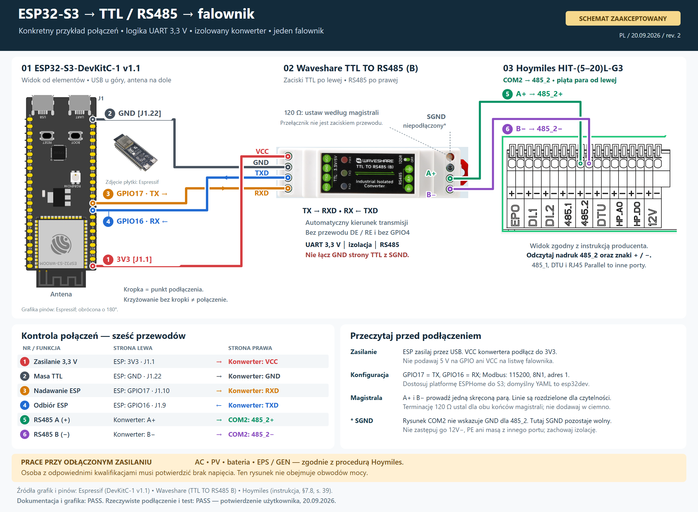

# Quick start / Szybki start — 1.5.8RC2

[English](#english--five-steps) · [Polski](#polski--pięć-kroków) · [README EN](../README.md) · [README PL](../README.pl.md)

> **1.5.8RC2 — release candidate / wersja przedpremierowa.**
> Select RC2 in HACS with prereleases visible. Use the matching `v1.5.8RC2`
> firmware packages. Existing installations: [upgrade from 1.5.7](UPGRADE_1_5_7.md).
> Wybierz RC2 w HACS i zgodny wariant ESP. Nie mieszaj nowych YAML ze starymi pakietami.

## English — five steps

Start with working **Home Assistant OS** and an administrator account. This
path uses the **File editor** and **ESPHome Device Builder** apps, called
*add-ons* in older HA versions. Home Assistant Container has no app store:
edit its mounted configuration directory and run ESPHome separately.

Check **Settings → System → Storage** before making an HA backup. A full
disk must be addressed before installation or database maintenance; see
[history and storage](RECORDER_AND_STORAGE.md#english). Keep USB access to
ESP32 for its first upload.
**HACS installs the HA integration; ESPHome builds firmware for ESP32.**
You need both parts. Check the [model compatibility scope](COMPATIBILITY.md#english);
the HIT-G3 wiring example is not a universal port diagram.

### 1. Install the tools and integration

1. Open **Settings → Apps → Install app** (older versions: **Settings →
   Add-ons → Add-on store**). Install **File editor** and **ESPHome Device
   Builder**, start them and enable **Show in sidebar**.
2. If you do not have **HACS**, complete the
   [official HACS setup](https://www.hacs.xyz/docs/use/) first. HACS manages
   community integrations; it is separate from the HA app store.
3. In **HACS → ⋮ → Custom repositories**, enter
   `https://github.com/Kaluzaburza/hoymiles-hit-g3-ems`, choose **Integration**
   and add it. The HACS button in the README is an alternative shortcut.
4. Find **EMS for Hoymiles HIT-(5–20)L-G3** in HACS and download it.
5. In **Settings → ⋮ → Restart Home Assistant**, choose a full **Restart**.
   Wait for HA to reconnect. Do not choose **Stop** or **Quick reload**.

**Expected result:** EMS is available in **Add integration**. You will select
its ESPHome source in step 4.

### 2. Connect the ESP32 and choose the RS485 variant

Follow the [wiring diagrams and isolation procedure](../README.md#2-connect-the-esp32-and-rs485-converter).
A qualified person must isolate every inverter energy source and verify the
absence of voltage before changing wiring. Disconnecting the grid alone does
not isolate PV, battery, EPS or GEN.

GPIO17 (TX) connects to the converter input **DI/RXD**, GPIO16 (RX) to its
output **RO/TXD**, and ESP GND to the converter's TTL-side GND. The converter
needs **3.3 V UART logic**. Connect A/B to the inverter's documented external
Modbus port and a reference only if required by the device manuals.
Never connect ESP32 3.3 V or converter VCC to an inverter
communication terminal.

**Illustrated example:** ESP32-S3-DevKitC-1 v1.1 + isolated Waveshare
TTL TO RS485 (B) + Hoymiles HIT-(5–20)L-G3, **COM2 / 485_2**.
The original illustration shows the board, converter and COM2 terminal strip
with Polish labels; the connections are described in English below. Click to enlarge.

[](images/esp32-s3-rs485-hoymiles-pl.png)

For this isolated converter, TTL `GND` connects only to ESP GND; do not bridge
it to `SGND`. Connect `A+ → 485_2+` and `B− → 485_2−`; SGND remains
unconnected in this example. Check the named hardware and choose the S3 N16R8 file below.
Do not copy classic ESP32 advanced flags into S3. [Acceptance and sources](WIRING_ESP32_S3.md):
actual wiring and test confirmed by the user on 20 September 2026.

Choose **one** device file:

| Converter | File | Direction pin |
|---|---|---|
| S3 N16R8, automatic direction | [`hoymiles-inverter-s3.yaml`](../hoymiles-inverter-s3.yaml) | None; [board/memory details](ESP32_VARIANTS.md) |
| Classic ESP32, automatic direction | [`hoymiles-inverter.yaml`](../hoymiles-inverter.yaml) | None |
| Exposed **DE** and **/RE** requiring manual direction | [`hoymiles-inverter-flow-control.yaml`](../hoymiles-inverter-flow-control.yaml) | Join DE and /RE; connect to GPIO4, or set `uart_flow_control_pin` to your actual free output pin |

GPIO4 is an example, not a universal board pin. All three variants share EMS
packages and entity identifiers. Do not create two ESPHome devices for one
ESP32. On a parallel installation, the same external RS485 bus must reach
the Master **and every Slave**. A Master-only cable cannot deliver broadcasts
to a disconnected Slave.

**Expected result:** wiring, board and selected YAML variant agree.

### 3. Prepare the device file, secrets and firmware

1. Open the selected YAML link above. On GitHub, click **Raw** and copy the
   **whole file**. Do not copy line numbers, the GitHub page or Markdown fences.
2. Open **File editor** in HA. Use the folder icon to open `/config/esphome/`;
   create this directory if absent. Create a file with the selected name,
   paste the YAML and save. `/config` means HA's configuration root; an editor
   may display this root as `/homeassistant`.
3. Review `name`, `friendly_name`, `board`, `uart_tx_pin`, `uart_rx_pin` and,
   for manual direction, `uart_flow_control_pin`. The default is `esp32dev`
   with ESP-IDF and minimum chip revision **3.1**. S3 N16R8 uses its own 16 MB/octal PSRAM profile. Keep the Modbus intervals and package list.
4. In the **same ESPHome directory**, open or create `secrets.yaml`. Add the
   four keys from [`secrets.yaml.example`](../secrets.yaml.example), replacing
   example values with your own. Preserve keys used by other devices.
   This is `/config/esphome/secrets.yaml`, not HA's `/config/secrets.yaml`.

   | Key | Value |
   |---|---|
   | `wifi_ssid` | Your Wi-Fi network name |
   | `wifi_password` | Its password |
   | `fallback_password` | Your own fallback access-point password, at least 8 characters |
   | `api_key` | A 32-byte Base64 encryption key from the ESPHome device wizard or [ESPHome API key generator](https://esphome.io/components/api/#configuration-variables) |

   Keep these values private. Leave the `!secret` references in the device
   YAML: they read the matching keys from `secrets.yaml`.

5. Open **ESPHome Device Builder**. On the device card choose **⋮ → Validate**.
   Correct any error in the indicated file and line before continuing.
6. Choose **Install**. For the first upload, connect ESP32 with a USB **data**
   cable. Select the option matching its location: the computer running your
   browser, or the computer running ESPHome. Follow the displayed USB
   instructions. Wireless installation requires compatible ESPHome firmware
   already running on a network-reachable device.

**Expected result:** build and upload succeed, ESP32 joins Wi-Fi and ESPHome
shows it online. That alone does not prove communication with the inverter.

Do not copy the repository's `packages/` directory to HA or ESPHome. The YAML
downloads the matching ESPHome packages from the release tag. If you see
`Source for extension of ID 'modbus_uart' was not found`, an old manual-direction
example remains. Use the complete flow-control file or the
[correct UART block](../README.md#converter-with-de-and-re).

### 4. Add the source device and enable Home Assistant packages

1. In **Settings → Devices & services**, configure the discovered **ESPHome**
   device. If absent, use **Add integration → ESPHome** and its IP address.
   When asked for an encryption key, enter the `api_key` from step 3. Check
   that the inverter readings update.
2. Choose **Add integration → EMS for Hoymiles HIT-(5–20)L-G3** and select
   that ESPHome device. The integration installs its package, dashboard and
   frontend assets. Do not paste the scheduler manually.
3. In **File editor**, return to the HA configuration root and open
   **`configuration.yaml`**. That is the exact filename.
4. Find `homeassistant:`. If absent, add this full block at the end of the
   file, leaving all existing lines in place:

   ```yaml
   homeassistant:
     packages: !include_dir_named packages
   ```

   If `homeassistant:` exists, add **only** the indented `packages:` line
   inside it. For example, preserve an existing name:

   ```yaml
   homeassistant:
     name: Home
     packages: !include_dir_named packages
   ```

   Use **two spaces**, not tabs. Never duplicate `homeassistant:` or
   `packages:`. If packages already use another include layout, preserve it
   and follow [HA's package documentation](https://www.home-assistant.io/docs/configuration/packages/)
   and the EMS Repair message instead of adding a competing include.
5. Save. Confirm `/config/packages/hoymiles_ems_scheduler.yaml` exists.
   This **HA** package directory is different from the **ESPHome** packages
   downloaded in step 3.
6. Check [Recorder retention, maintenance and required history](RECORDER_AND_STORAGE.md#english).
   For a new installation, plan for **35 days** of raw history to cover the
   current LOAD reader's 31-day lookback. Verify available space and recording
   growth before extending retention. Preserve existing settings and filters;
   do not exclude all Hoymiles entities or the Supervisor. Backup compression
   does not reduce the live history database.
7. Open **Settings → Tools → YAML → Check configuration** (older versions:
   **Developer tools → YAML**). Fix any error, then perform a full
   **Restart Home Assistant**. This loads the newly installed EMS package;
   it is separate from the restart after HACS in step 1.

**Expected result:** **Installation status = Ready**, with no EMS package
Repair. If a Repair requests another restart because the managed file was
installed after YAML loaded, follow it and check again.

### 5. Add Aurora, verify readings and configure your first plan

1. In **Settings → Dashboards → Add dashboard**, select the community
   dashboard **EMS for Hoymiles HIT-(5–20)L-G3**, give it a title and add it.
   Resources are registered automatically; no manual Lovelace resource or
   dashboard YAML paste is needed.
2. Open **Overview**. Compare PV, household load, grid flow, battery power
   and SOC with the inverter display or manufacturer app. SOC is battery
   charge in percent; **kW** is power, **kWh** is energy over a period.
   After readings have accumulated, open **Yesterday** on the EMS chart and
   check that new measurements appear. A new installation has no earlier
   history; execution colors require recorded evidence of actual operation.
3. In **Settings**, verify battery capacity, inverter power, BMS limits and
   the Self-Use reserve against the physical installation. Configure
   [BJReplay Solcast PV Forecast](https://github.com/BJReplay/ha-solcast-solar)
   for forecast planning: Today and Tomorrow must be available; Day 3 is
   optional. RCE needs current PSE prices; Pstryk needs public hourly net prices.
   Select the actual purchase operator/tariff and sale source. For PGE G12e,
   check the contract and meter schedule in [G12e details](PGE_G12E.md).
   Pstryk BUY/SELL uses one price profile with separate permissions.
4. Keep automatic execution off until these checks pass. Configure the desired
   policy, then allow its execution in **EMS**. A policy enabled in settings
   can calculate a plan while the EMS execution switch is off. Read **Now**,
   **Next action**, plan status and chart details. Keep experimental RCEm
   observation-only until site-specific commissioning.
5. Click **System online** at the top to inspect current faults and history.
   **Clear inverter faults** sends a command; verify its physical result.
   **Restart EMS** reloads the integration and preserves policy settings.
   Each action requires a second click within six seconds.

**Expected result:** Aurora displays plausible readings and clear plan states.
A forecast or green badge does not prove an executed command. Before parallel
automatic control is commissioned, verify operation and return to Self-Use
separately on the Master and every Slave; Master readback does not prove Slave
execution. See the [safety and acceptance guide](SAFETY_AND_COMPLIANCE.md).

### Updating an existing installation

Follow the [RC2 update steps](releases/v1.5.8rc2.md#user-update-steps--kroki-po-aktualizacji),
not the fresh-install steps. Pause automatic writers, confirm the physical
neutral state, back up customizations, update HA/managed assets and complete
the requested configuration check/restart flow. An upgrade from 1.5.7 needs
compatible protocol-2 ESP firmware; after publication its package ref is
`v1.5.8RC2`. HACS does not flash ESP32. Verified devices already using the same
protocol-2 runtime packages do not need reflashing just for release metadata.
Retain device identity, board/pins, secrets, RS485 variant and user settings.

## Polski — pięć kroków

Instrukcja zakłada działający **Home Assistant OS** i konto administratora.
Korzystamy z aplikacji **File editor** oraz **ESPHome Device Builder**,
nazywanych *dodatkami* w starszych wersjach HA. Home Assistant Container nie
ma sklepu z aplikacjami: edytujesz podłączony katalog konfiguracji,
a ESPHome uruchamiasz osobno.

Przed wykonaniem kopii HA sprawdź **Ustawienia → System → Pamięć masowa**.
Pełny dysk trzeba odciążyć przed instalacją lub konserwacją bazy; zobacz
[historię i miejsce na dysku](RECORDER_AND_STORAGE.md#polski). Zapewnij dostęp
do ESP32 przez USB na czas pierwszego wgrywania.
**HACS instaluje integrację w HA, a ESPHome buduje
firmware dla ESP32.** Potrzebne są obie części. Sprawdź
[zakres zgodności modelu](COMPATIBILITY.md#polski); schemat HIT-G3 nie jest
uniwersalnym rysunkiem portów wszystkich falowników.

### 1. Zainstaluj narzędzia i integrację

1. Otwórz **Ustawienia → Aplikacje → Zainstaluj aplikację** (w starszych
   wersjach: **Ustawienia → Dodatki → Sklep z dodatkami**). Zainstaluj
   **File editor** i **ESPHome Device Builder**, uruchom je oraz zaznacz
   **Pokaż na pasku bocznym**.
2. Jeśli nie masz **HACS**, wykonaj najpierw
   [oficjalną instrukcję HACS](https://www.hacs.xyz/docs/use/). HACS służy
   do instalacji integracji społecznościowych; to osobne narzędzie,
   niezależne od sklepu z aplikacjami HA.
3. W **HACS → ⋮ → Własne repozytoria** wklej
   `https://github.com/Kaluzaburza/hoymiles-hit-g3-ems`, wybierz kategorię
   **Integracja / Integration** i dodaj repozytorium. Możesz też użyć
   przycisku HACS na początku README.
4. Wyszukaj **EMS for Hoymiles HIT-(5–20)L-G3** w HACS i pobierz integrację.
5. W **Ustawienia → ⋮ → Uruchom ponownie Home Assistant** wybierz pełny
   **Restart**. Zaczekaj na powrót połączenia. Nie wybieraj **Zatrzymaj**
   ani **Szybkie przeładowanie**.

**Wynik:** EMS pojawi się na liście **Dodaj integrację**.
Urządzenie źródłowe wybierzesz w kroku 4.

### 2. Podłącz ESP32 i wybierz wariant RS485

Skorzystaj ze [schematów i procedury odłączenia zasilania](../README.pl.md#2-podłącz-esp32-i-konwerter-rs485).
Przed zmianą przewodów osoba z odpowiednimi kwalifikacjami musi odłączyć
wszystkie źródła energii i potwierdzić brak napięcia. Samo odłączenie sieci
nie odłącza PV, baterii, EPS ani GEN.

GPIO17 (TX) połącz z wejściem konwertera **DI/RXD**, GPIO16 (RX) z jego
wyjściem **RO/TXD**, a GND ESP z GND strony TTL konwertera. Konwerter musi mieć
**logikę UART 3,3 V**. A/B podłącz do zewnętrznego portu Modbus z instrukcji
falownika, a przewód odniesienia tylko wtedy, gdy wymagają go instrukcje urządzeń.
Nie podłączaj 3,3 V ESP32 ani VCC konwertera do zacisku komunikacyjnego
falownika.

**Przykład na ilustracji:** ESP32-S3-DevKitC-1 v1.1 + izolowany Waveshare
TTL TO RS485 (B) + Hoymiles HIT-(5–20)L-G3, **COM2 / 485_2**.
Wcześniejsza ilustracja pokazuje płytkę, konwerter i listwę COM2 z polskimi
podpisami. Kliknij, aby powiększyć.

[](images/esp32-s3-rs485-hoymiles-pl.png)

Dla tego izolowanego konwertera masa TTL `GND` łączy się tylko z GND ESP;
nie mostkuj jej z `SGND`. Połącz `A+ → 485_2+` i `B− → 485_2−`;
SGND pozostaje w tym przykładzie niepodłączony. Sprawdź zgodność modeli z ilustracją i wybierz poniżej plik S3 N16R8.
Nie kopiuj do S3 zaawansowanych flag klasycznego ESP32.
[Odbiór i źródła](WIRING_ESP32_S3.md): użytkownik potwierdził zgodność
z rzeczywistym podłączeniem i zaliczenie testu 20 września 2026 r.

Wybierz **jeden** plik urządzenia:

| Konwerter | Plik | Pin kierunku |
|---|---|---|
| S3 N16R8, automatyczny kierunek | [`hoymiles-inverter-s3.yaml`](../hoymiles-inverter-s3.yaml) | Niewymagany; [płytka i pamięć](ESP32_VARIANTS.md) |
| Klasyczny ESP32, automatyczne przełączanie kierunku | [`hoymiles-inverter.yaml`](../hoymiles-inverter.yaml) | Niewymagany |
| Wyprowadzone **DE** i **/RE**, wymagające ręcznego sterowania | [`hoymiles-inverter-flow-control.yaml`](../hoymiles-inverter-flow-control.yaml) | Połącz DE z /RE i podłącz do GPIO4 albo zmień `uart_flow_control_pin` na faktycznie użyty, wolny pin wyjściowy |

GPIO4 jest przykładem, a nie pinem właściwym dla każdej płytki. Wszystkie trzy warianty
używają tych samych pakietów EMS i identyfikatorów encji. Nie dodawaj dwóch
urządzeń ESPHome dla jednego ESP32. W układzie równoległym ta sama zewnętrzna
magistrala RS485 musi dochodzić do Mastera **i każdego Slave'a**. Przewód tylko
do Mastera nie dostarczy rozgłoszenia do niepodłączonego Slave'a.

**Wynik:** okablowanie, płytka i wybrany wariant YAML są zgodne.

### 3. Przygotuj plik urządzenia, sekrety i firmware

1. Otwórz powyższy link do wybranego YAML. Na GitHubie kliknij **Raw**
   i skopiuj **całą zawartość pliku**. Nie kopiuj numerów wierszy, strony
   GitHuba ani znaczników bloku kodu.
2. Otwórz **File editor** w HA. Kliknij ikonę folderu i przejdź do
   `/config/esphome/`; jeśli katalogu nie ma, utwórz go. Utwórz plik o wybranej
   nazwie, wklej YAML i zapisz. `/config` oznacza główny katalog konfiguracji
   HA; edytor może pokazywać go jako `/homeassistant`.
3. Sprawdź `name`, `friendly_name`, `board`, `uart_tx_pin`, `uart_rx_pin`
   oraz — w wariancie ręcznym — `uart_flow_control_pin`. Domyślna konfiguracja
   to `esp32dev`, ESP-IDF i minimalna rewizja układu **3.1**. S3 N16R8 ma osobny profil 16 MB flash i octal PSRAM. Zachowaj podane interwały
   Modbus i listę pakietów.
4. W **tym samym katalogu ESPHome** otwórz lub utwórz `secrets.yaml`.
   Dodaj cztery klucze z [`secrets.yaml.example`](../secrets.yaml.example)
   i zastąp przykładowe wartości własnymi. Zachowaj wpisy innych urządzeń.
   Chodzi o `/config/esphome/secrets.yaml`, a nie plik `/config/secrets.yaml`
   używany przez HA.

   | Klucz | Wartość |
   |---|---|
   | `wifi_ssid` | Nazwa swojej sieci Wi-Fi |
   | `wifi_password` | Hasło do tej sieci |
   | `fallback_password` | Własne hasło awaryjnego punktu dostępu, co najmniej 8 znaków |
   | `api_key` | Klucz szyfrowania: 32 bajty w Base64, utworzony przez kreator urządzenia ESPHome lub [generator klucza API ESPHome](https://esphome.io/components/api/#configuration-variables) |

   Nie udostępniaj tych wartości. W pliku urządzenia pozostaw odwołania
   `!secret` — pobierają wartości z odpowiednich kluczy w `secrets.yaml`.

5. Otwórz **ESPHome Device Builder**. Na karcie urządzenia wybierz
   **⋮ → Validate**. Przed dalszą pracą popraw ewentualny błąd we wskazanym
   pliku i wierszu.
6. Wybierz **Install**. Pierwsze wgrywanie wykonaj przez przewód USB
   **z transmisją danych**. Wybierz opcję odpowiadającą miejscu podłączenia
   ESP32: komputer z przeglądarką albo komputer, na którym działa ESPHome.
   Dalej postępuj według wyświetlonej instrukcji USB. Wgrywanie bezprzewodowe
   wymaga działającego, zgodnego firmware ESPHome i dostępności urządzenia
   w sieci.

**Wynik:** kompilacja i wgrywanie kończą się poprawnie, ESP32 łączy się
z Wi-Fi, a ESPHome pokazuje urządzenie online. Sam status online nie dowodzi
jeszcze komunikacji z falownikiem.

Nie kopiuj katalogu `packages/` z repozytorium do HA ani ESPHome. YAML pobiera
właściwe pakiety ESPHome z tagu wydania. Błąd
`Source for extension of ID 'modbus_uart' was not found` oznacza, że pozostał
stary przykład ręcznego kierunku. Użyj gotowego wariantu flow control albo
[poprawnego bloku UART](../README.pl.md#konwerter-z-de-i-re).

### 4. Dodaj źródłowe urządzenie i włącz pakiety Home Assistanta

1. W **Ustawienia → Urządzenia i usługi** skonfiguruj wykryte urządzenie
   **ESPHome**. Jeśli go nie ma, wybierz **Dodaj integrację → ESPHome**
   i wpisz jego IP. Gdy HA poprosi o klucz szyfrowania, podaj `api_key`
   z kroku 3. Sprawdź, czy odczyty falownika się aktualizują.
2. Wybierz **Dodaj integrację → EMS for Hoymiles HIT-(5–20)L-G3** i wskaż
   to urządzenie ESPHome. Integracja zainstaluje pakiet, dashboard i zasoby
   interfejsu. Nie wklejaj schedulera ręcznie.
3. W **File editor** wróć do głównego katalogu konfiguracji HA i otwórz
   **`configuration.yaml`**. To dokładna nazwa pliku.
4. Poszukaj `homeassistant:`. Jeśli go nie ma, dodaj na końcu pliku cały
   poniższy blok, pozostawiając wszystkie istniejące wiersze:

   ```yaml
   homeassistant:
     packages: !include_dir_named packages
   ```

   Jeśli `homeassistant:` już istnieje, dodaj wewnątrz niego **tylko**
   wcięty wiersz `packages:`. Przykładowo istniejąca nazwa domu zostaje:

   ```yaml
   homeassistant:
     name: Dom
     packages: !include_dir_named packages
   ```

   Wcięcie to **dwie spacje**, nie tabulator. Nie powielaj kluczy
   `homeassistant:` ani `packages:`. Jeśli masz już inny układ wczytywania
   pakietów, zachowaj go i skorzystaj z
   [instrukcji pakietów HA](https://www.home-assistant.io/docs/configuration/packages/)
   oraz komunikatu Naprawy EMS. Nie dopisuj konkurencyjnego wczytywania.
5. Zapisz plik. Sprawdź, czy istnieje
   `/config/packages/hoymiles_ems_scheduler.yaml`. To katalog pakietów **HA**,
   inny niż pakiety **ESPHome** pobierane w kroku 3.
6. Sprawdź [retencję, konserwację Recordera i wymagane dane historyczne](RECORDER_AND_STORAGE.md#polski).
   Dla nowej instalacji zaplanuj **35 dni** surowej historii, aby objąć 31-dniowy
   zakres odczytu obecnego modelu LOAD. Przed wydłużeniem retencji sprawdź
   zapas miejsca i tempo zapisu. Zachowaj istniejące ustawienia oraz filtry;
   nie wykluczaj wszystkich encji Hoymiles ani nadzorcy. Kompresja kopii
   zapasowych nie zmniejsza działającej bazy historii.
7. Otwórz **Ustawienia → Narzędzia → YAML → Sprawdź konfigurację**
   (w starszych wersjach: **Narzędzia deweloperskie → YAML**).
   Popraw błędy, a następnie wykonaj pełne **Uruchom ponownie Home Assistant**.
   Ten restart wczytuje nowy pakiet EMS; jest osobny od restartu po HACS
   w kroku 1.

**Wynik:** **Stan instalacji = Gotowe**, bez Naprawy dotyczącej pakietu EMS.
Jeśli Naprawa prosi o kolejny restart, bo plik zainstalowano już po wczytaniu
YAML, wykonaj go i sprawdź stan ponownie.

### 5. Dodaj Aurorę, sprawdź odczyty i skonfiguruj pierwszy plan

1. W **Ustawienia → Panele → Dodaj panel** wybierz panel społecznościowy
   **EMS for Hoymiles HIT-(5–20)L-G3**, nadaj mu tytuł i dodaj go.
   Zasoby rejestrują się automatycznie; nie dodawaj ręcznie zasobu Lovelace
   ani nie wklejaj YAML dashboardu.
2. Otwórz **Przegląd**. Porównaj PV, zużycie domu, przepływ sieci, moc
   magazynu i SOC z ekranem falownika albo aplikacją producenta.
   SOC to procent naładowania baterii, **kW** oznacza moc, a **kWh** —
   energię w określonym czasie.
   Po zebraniu odczytów otwórz **Wczoraj** na wykresie EMS i sprawdź, czy
   pojawiają się nowe pomiary. Nowa instalacja nie ma wcześniejszej historii;
   kolory wykonania wymagają zapisanych dowodów rzeczywistego działania.
3. W **Ustawieniach** sprawdź pojemność baterii, moc falownika, limity BMS-u
   i rezerwę Self-Use według rzeczywistej instalacji. Do planowania z prognozą
   skonfiguruj [BJReplay Solcast PV Forecast](https://github.com/BJReplay/ha-solcast-solar).
   Potrzebne są prognozy na dziś i jutro; Dzień 3 jest opcjonalny.
   RCE wymaga aktualnych cen PSE, a Pstryk publicznych godzinowych cen netto.
   Wybierz rzeczywistego operatora i taryfę zakupu oraz źródło cen sprzedaży.
   Dla PGE G12e sprawdź umowę i harmonogram licznika w [opisie G12e](PGE_G12E.md).
   Zakup i sprzedaż Pstryk mają wspólny profil cen, ale niezależne zgody.
4. Do zakończenia kontroli pozostaw automatyczne wykonanie wyłączone.
   Skonfiguruj wybrany plan, a następnie zezwól na jego wykonanie w **EMS**.
   Planer włączony w ustawieniach może liczyć plan przy wyłączonym
   przełączniku wykonania EMS. Sprawdź **Teraz**, **Następną akcję**, status
   planu i szczegóły wykresu. Eksperymentalny RCEm pozostaw obserwacyjny
   do odbioru na konkretnej instalacji.
5. Kliknij górną kontrolkę **System działa**, aby obejrzeć bieżące błędy
   i historię. **Wyczyść alarmy falownika** wysyła polecenie — jego skutek
   sprawdź w rzeczywistym stanie falownika. **Uruchom ponownie EMS**
   przeładowuje integrację i zachowuje ustawienia planów. Obie akcje wymagają
   drugiego kliknięcia w ciągu sześciu sekund.

**Wynik:** Aurora pokazuje wiarygodne odczyty i zrozumiałe stany planów.
Prognoza ani zielona kontrolka nie dowodzą wykonania polecenia. Przed odbiorem
automatyki układu równoległego potwierdź działanie i powrót do Self-Use osobno
na Masterze i każdym Slave'ie. Odczyt Mastera nie dowodzi wykonania przez Slave'a.
Szczegóły zawiera [instrukcja bezpieczeństwa i odbioru](SAFETY_AND_COMPLIANCE.md).

### Aktualizacja istniejącej instalacji

Wykonaj [kroki aktualizacji RC2](releases/v1.5.8rc2.md#user-update-steps--kroki-po-aktualizacji),
a nie ścieżkę świeżej instalacji. Wstrzymaj automatycznych wykonawców,
potwierdź fizyczny stan neutralny, zabezpiecz własne pliki, zaktualizuj HA
i zarządzane zasoby, sprawdź konfigurację i wykonaj wymagane restarty.
Przejście z 1.5.7 wymaga zgodnego firmware'u ESP z protokołem 2;
odwołaniem do pakietów będzie `v1.5.8RC2`. HACS nie wgrywa ESP32. Zweryfikowane
urządzenia z takimi samymi pakietami runtime protokołu 2 nie wymagają flashowania
wyłącznie dla metadanych wydania. Zachowaj tożsamość urządzenia, płytkę, piny,
sekrety, wariant RS485 i ustawienia użytkownika.

## Official references / Oficjalne instrukcje

- [Editing configuration.yaml / Edycja configuration.yaml](https://www.home-assistant.io/docs/configuration/)
- [HA OS: apps and configuration checks / Aplikacje i sprawdzanie konfiguracji](https://www.home-assistant.io/common-tasks/os/)
- [ESPHome packages / Pakiety ESPHome](https://esphome.io/components/packages/)
- [ESPHome UART flow control / Sterowanie kierunkiem UART](https://esphome.io/components/uart/)
- [Issue #33: incorrect UART extension / Błędne rozszerzenie UART](https://github.com/Kaluzaburza/hoymiles-hit-g3-ems/issues/33)

Encrypted OTA for existing devices / Szyfrowane OTA istniejących urządzeń:
[Migration and backup procedure / Migracja i kopia](ESP32_ESPHOME_2026_9.md).
